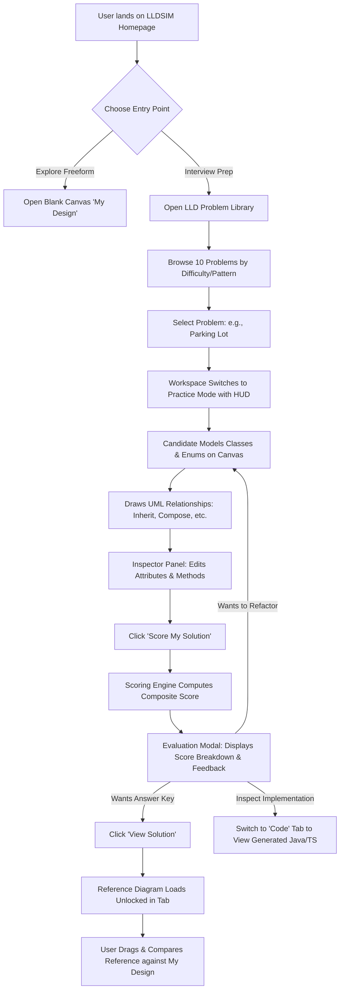
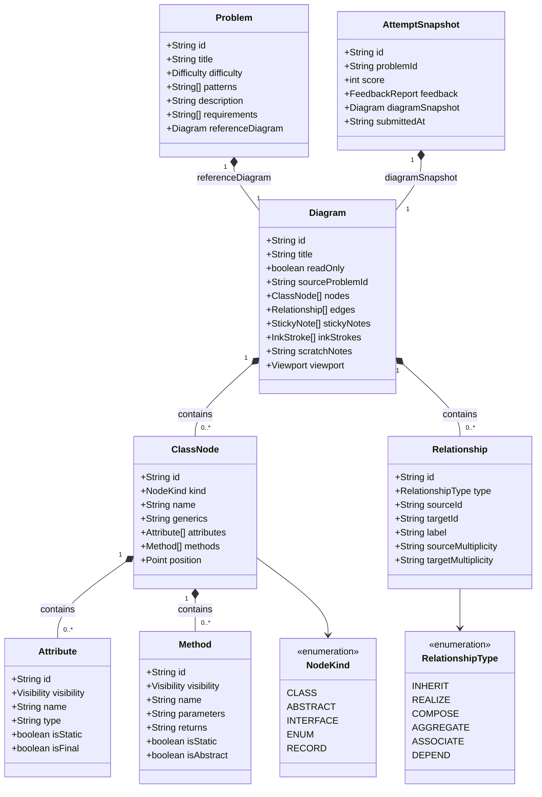

# LLDSIM (LLD Studio) — Product & Technical Specification Document (MVP)

**Document Version:** 1.0 (Post-MVP Launch)  
**Author:** Technical Product Manager (TPM)  
**Target Audience:** Engineering, Product Leadership, System Architects, Technical Interviewers  
**Repository:** `LLD_Ease` (LLDSIM)  
**Status:** Shipped & Verified  

---

## 1. Executive Summary & Vision

### 1.1 Product Identity
**LLDSIM** (Interactive Low-Level Design Studio) is a browser-native, zero-latency computer-aided design and evaluation environment purpose-built for **Low-Level Design (LLD) and Object-Oriented Design (OOD)**.

It serves as the definitive **"LeetCode for Object-Oriented Architecture"**, bridging the gap between theoretical software engineering principles and real-world system modeling.

### 1.2 The Core Value Proposition
> *"Model complex object-oriented architectures on an intelligent canvas, validate structural integrity in real time, generate production-grade polyglot code, and receive instant, automated rubric grading against industry benchmark solutions."*

### 1.3 Target Audience & ICPs (Ideal Customer Profiles)
1. **Software Engineers (SDE II, SDE III, Staff Candidates):** Preparing for FAANG/Tier-1 machine coding and object-oriented system design rounds.
2. **Tech Leads & Solutions Architects:** Rapidly drafting class relationships, validating domain contracts, and communicating component boundaries without bloated enterprise UML software.
3. **Computer Science Students & Bootcamp Learners:** Moving beyond basic coding syntax into design patterns (Strategy, Factory, State, Observer) and SOLID principles with an interactive feedback loop.

---

## 2. The Problem Landscape & Market Gap

| Traditional Approach | How It Works | Critical Flaw / Why It Fails |
| :--- | :--- | :--- |
| **General Whiteboarding** *(Excalidraw, Miro, Lucidchart)* | Freehand boxes, text, lines | **Zero semantic understanding.** Boxes are just visual pixels. Tools cannot enforce UML rules, detect invalid relationships (e.g., a class "realizing" another class), generate executable code, or grade design completeness. |
| **Algorithmic Judges** *(LeetCode, HackerRank)* | Function signature unit tests | **Scope is purely algorithmic.** LeetCode tests $O(N)$ runtime of single algorithms; it does not evaluate extensibility, loose coupling, interface segregation, or modular design. |
| **Passive Learning** *(YouTube, Books, Medium)* | Reading "Grokking LLD" or watching tutorials | **Passive consumption without active recall.** Candidates nod along to video solutions but freeze when asked to construct an extensible class diagram from scratch in a 45-minute interview. |

### The LLDSIM Solution
LLDSIM introduces an active **"Model $\rightarrow$ Lint $\rightarrow$ Score $\rightarrow$ Code"** loop:
1. **Active Retrieval:** Users read structured requirements briefs and model abstractions from scratch.
2. **Instant Structural Linter:** Real-time feedback catches UML violations (e.g., circular inheritance, instantiating interfaces, missing return types).
3. **Deterministic Rubric Scoring:** A 5-dimension evaluation engine evaluates structural abstractions, relationships, and design patterns against industry benchmark solutions.
4. **Code Synthesis:** Instant compilation to 6 programming languages proves that the visual UML model actually translates into clean, idiomatic software.

---

## 3. Core MVP Feature Set

### 3.1 Intelligent UML Canvas Studio
- **Domain-Specific Node Kinds:** Class, Abstract Class, Interface, Enum, and Record.
- **Strict UML Stereotypes:** Visual tags (`«interface»`, `«enumeration»`, `«abstract»`, `«record»`) rendered with distinct styling tokens.
- **Compartmentalized Class Layout:** Standard UML 3-tier presentation (Name & Stereotype header, typed attributes compartment with visibility sigils, typed methods compartment with parameters and return types).
- **Interactive Connection Engine:** High-contrast edge routing with 6 formal UML relationship types:
  - **Inheritance** (Closed triangular arrowhead)
  - **Realization** (Dashed line with closed triangular arrowhead)
  - **Composition** (Solid filled diamond at container)
  - **Aggregation** (Hollow diamond at container)
  - **Association** (Open navigation arrow with optional role label and multiplicity)
  - **Dependency** (Dashed open arrow)
- **Whiteboard Thinking Affordances:** Repositionable colored Sticky Notes and freehand vector Ink drawing layer overlaying the canvas for brainstorming before formalizing.

### 3.2 Curated Industry Problem Library
A catalog of 10 classic machine-coding problems covering diverse design patterns:
1. **Parking Lot** (*Medium* — Strategy, Factory, Singleton)
2. **Splitwise / Expense Sharing** (*Medium* — Strategy, Factory)
3. **Elevator System** (*Hard* — Strategy, State)
4. **Vending Machine** (*Medium* — State)
5. **Library Management System** (*Medium* — Aggregate Root)
6. **Chess Game Rules Engine** (*Hard* — Factory, Strategy, Template Method)
7. **LRU Cache** (*Easy* — Strategy, HashMap + DoublyLinkedList)
8. **Movie Ticket Booking** (*Medium* — Singleton, Observer, Strategy)
9. **Restaurant Table Reservation** (*Medium* — Aggregate Root, State)
10. **Tic-Tac-Toe** (*Easy* — OOP Fundamentals)

### 3.3 Benchmark Reference Solutions & Interactive Canvas Exploration
- Every problem features a verified, gold-standard reference diagram authored with explicit domain entities, attributes, and relationships.
- Reference diagrams load into a dedicated tab with a **REF** badge.
- **Unlocked by Default & Movable:** Users can rearrange and drag nodes on the canvas to inspect complex relationships without UI lockup.
- **Lock / Unlock Toggle:** Users can lock the tab into read-only mode to prevent accidental edits or unlock it to experiment directly.

### 3.4 Automated 5-Dimension Evaluation & Scoring Engine
Scores candidate designs (0–100) using a multi-phase evaluation pipeline:
1. **Abstractions Score (Weight: 35%):** Uses normalized Levenshtein-ratio string distance ($\ge 0.6$ threshold) and greedy bipartite matching to pair user classes with reference classes. Evaluates kind alignment (e.g. abstract vs concrete), attribute coverage, and method signatures.
2. **Relationships Score (Weight: 30%):** Validates whether required relationships exist between paired entities and checks whether relationship types (Inheritance vs Composition vs Realization) are accurate.
3. **Design Patterns Score (Weight: 20%):** Detects signature architectural topologies (e.g., interface with multiple realization subclasses for Strategy; state interface with transition methods for State; private constructor + static instance for Singleton).
4. **Code Quality / SOLID Heuristics (Weight: 10%):** Checks for god classes ($>7$ methods), empty classes, or deep inheritance trees ($>3$ levels).
5. **Rubric Guidance (Weight: 5%):** Penalizes anti-patterns and generates prioritized action items.

### 3.5 Actionable Feedback & Mentorship Rubrics
- Generates categorized feedback cards:
  - **Concerns (Red/Amber):** Critical omissions (e.g., missing `PaymentStrategy` interface, hardcoding concrete payment classes).
  - **Suggestions (Blue/Teal):** Refinement tips (e.g., converting concrete class `Vehicle` to an `Abstract Class`).
  - **Affirmations (Green):** Successfully matched abstractions and correct design patterns.
- Direct Canvas Linking: Clicking an issue card auto-focuses the relevant node on the canvas.

### 3.6 Polyglot Real-Time Code Synthesis
Continuously compiles the visual canvas model into idiomatic code across 6 languages:
- **Java** (interfaces, abstract classes, access modifiers, `@Override`)
- **TypeScript** (type annotations, export declarations, interface contracts)
- **Python** (`abc.ABC`, `@abstractmethod`, `__init__` constructor, dataclasses)
- **JavaScript** (ES6 classes, constructor assignments)
- **C++** (header/class definitions, virtual destructors, pure virtual methods)
- **C#** (PascalCase naming, namespace grouping, property getters/setters)
- Toggleable code formatting options: Constructors, Getters/Setters, `toString`, Doc comments.

### 3.7 Historical Attempt Tracking & Progression
- Automated immutable snapshotting upon each scoring execution.
- Problem cards display attempt counts and personal best scores.
- Attempt History modal allows re-opening historical snapshots in past attempt tabs (`PAST` badge) to visually compare past attempts against the reference.

### 3.8 Architectural Design System & Landing Surface
- Dark, low-chroma industrial design system built on CSS tokens and Tailwind (`--canvas`, `--surface-1` through `--surface-4`, `--primary` teal).
- Marketing landing page with GSAP animations, Lenis smooth scrolling, live interactive canvas preview hero, problem showcase grid, and feature deep-dives.

---

## 4. End-to-End User Journeys

### 4.1 The Interview Candidate Journey (Practice Loop)
1. **Discovery:** User opens the problem library, reviews problem requirements, difficulty, and design patterns.
2. **Active Modeling:** User clicks "Start Problem". A top Practice HUD displays requirements. User drags nodes from the palette (e.g. `Vehicle`, `Car`, `ParkingSpot`, `FeeStrategy`).
3. **Contract Definition:** User selects nodes and uses the Inspector panel to add typed attributes (e.g. `licensePlate: String`, `entryTime: long`) and methods (`calculateFee()`).
4. **Relationship Synthesis:** User draws relationships by dragging handles or using keyboard shortcuts. Real-time linter flags errors if present.
5. **Evaluation:** User clicks "Score my solution". Within 300ms, the scoring modal displays a weighted score (e.g. `78/100`), highlights missing abstractions (e.g., missing pluggable `HourlyFeeStrategy`), and offers actionable hints.
6. **Benchmark Comparison:** User clicks "View solution" to inspect the reference architecture in a side-by-side tab, comparing edge topologies and enum relationships.
7. **Code Verification:** User switches to the Code tab to verify that the design produces syntactically valid Java or TypeScript code.

---

## 5. Core Domain Models & Class Architecture

### 5.1 Store Architecture (Zustand Slices)
The application state is partitioned into decoupled slices orchestrated via Zustand:
- **`workspaceSlice`**: Manages document tabs, active document ID, reference diagram loading, tab switching, and tab closing.
- **`documentSlice`**: CRUD operations on active diagram elements (`createNode`, `updateNode`, `removeNode`, `createEdge`, `updateEdge`, `removeEdge`, `stickyNotes`, `inkStrokes`). Enforces immutability and position tracking.
- **`practiceSlice`**: Manages active practice session, prompt display, attempt submission recording, and attempt history retrieval.
- **`uiSlice`**: Armed tools, active selection (`selectedElement`), modal states (`activeModal`), canvas fit-view triggers, and right-panel tab switching.
- **`toastSlice`**: Lightweight notifications (e.g., "Add classes before scoring").
- **`profileSlice`**: User profile state and attempt aggregation.

---

## 6. Technical Trade-Offs & Strategic Decisions

### Trade-off 1: Client-Side Only Architecture vs. Cloud Backend
- **Decision:** Built as a 100% browser-native SPA with `localStorage` persistence and zero backend microservices.
- **TPM Rationale:**
  - **Latency:** Instant evaluation and diagram rendering ($<5\text{ms}$ local execution vs. $300\text{ms}+$ roundtrip network API calls).
  - **Privacy & Security:** Candidates' work and proprietary interview questions remain entirely in their local browser sandbox.
  - **Cost & Ops:** Zero server hosting fees, zero database scaling overhead, zero downtime.
  - **Offline Capability:** Fully functional in disconnected environments (airplanes, campuses).

### Trade-off 2: Greedy Bipartite Matching vs. Optimal Hungarian Algorithm ($O(N^2)$ vs. $O(N^3)$)
- **Decision:** Implemented a greedy bipartite matching algorithm over the formal Kuhn-Munkres (Hungarian) algorithm.
- **TPM Rationale:**
  - In LLD interview problems, the maximum number of classes per problem is small ($N \le 20$, average $N \approx 8\text{--}15$).
  - For $N < 30$, greedy matching runs in $<1\text{ms}$ with imperceptible difference in pairing quality compared to Hungarian, but avoids several hundred lines of complex matrix-reduction logic, drastically reducing maintenance and bundle size.

### Trade-off 3: Deterministic Normalized Levenshtein Distance vs. LLM Embeddings for Scoring
- **Decision:** Scored abstractions using normalized Levenshtein-ratio string distance ($\ge 0.6$ match threshold) rather than querying an LLM API (OpenAI/Anthropic).
- **TPM Rationale:**
  - **Determinism:** Candidates need predictable, repeatable scoring. Submitting the exact same diagram twice must yield the exact same score.
  - **Zero Cost & Offline:** No recurring API token billing; works completely offline.
  - **No Hallucinations:** Prevents LLM judges from inventing non-existent rules or giving inconsistent grades.

### Trade-off 4: Fully Movable & Toggleable Reference Diagram vs. Rigid Read-Only Locking
- **Decision:** Reference solutions open with `nodesDraggable={true}` and offer a clickable Lock/Unlock toggle.
- **TPM Rationale:**
  - Initial versions made reference diagrams strictly frozen (`nodesDraggable={false}`). User feedback revealed frustration: users wanted to untangle lines, space out compact columns, and explore relationships visually.
  - Allowing node movement while providing an explicit Lock/Unlock toggle gives users the best of both worlds: safe inspection without accidental edits, but total layout control.

### Trade-off 5: Structured Inspector Form vs. PlantUML/Mermaid DSL Parsing
- **Decision:** Provided a visual GUI Inspector panel with dedicated inputs for attributes, methods, parameters, and visibility instead of a text-based code editor (like PlantUML).
- **TPM Rationale:**
  - Avoids syntax parsing errors and steep syntax learning curves during high-pressure interview practice.
  - Ensures clean, strongly-typed JSON domain structures that can directly feed the linter, code generator, and scoring engine without grammar ambiguity.

---

## 7. Quality Metrics & Validation Results

### 7.1 Verification Benchmarks
- **Type Safety:** 100% TypeScript compilation clean (`npx tsc --noEmit` exits with code 0).
- **Browser Compatibility:** Automated Chrome E2E verification across all user journeys (canvas creation, dragging, inspector editing, scoring, code generation, solution loading).
- **Performance:**
  - Bundle load time: $<600\text{ms}$ over broadband.
  - 60 FPS smooth canvas panning and zooming using hardware-accelerated transforms.
  - Code generation latency: $<10\text{ms}$ upon node selection.
  - Evaluation latency: $<50\text{ms}$ for comprehensive 15-class diagrams.

---

## 8. V2 / V3 Roadmap (Future Vision)

1. **V2 — Multiplayer Pair Programming & Mock Interviews:**
   - Real-time peer-to-peer collaboration using CRDTs (Yjs) and WebRTC.
   - Interviewer Mode: An interviewer can watch the candidate model in real time, pose follow-up constraints, and add annotations.
2. **V2 — Interactive Dynamic Simulation Sandbox:**
   - Execute the model live in a JavaScript sandbox (e.g., click "Simulate: Vehicle Arrives" $\rightarrow$ triggers `ParkingLot.parkVehicle()` $\rightarrow$ moves state $\rightarrow$ highlights spot occupancy on canvas).
3. **V3 — AI Conversational Design Coach (`/grill-me`):**
   - AI conversational interviewer that challenges design choices ("Why did you choose Aggregation instead of Composition here?", "How does your design handle thread safety?").
4. **V3 — Custom Problem Creator:**
   - Community-contributed problems with custom rubric weights and test benchmarks.
