# ClassForge — Low-Level Design (LLD) Studio

<div align="center">


**A professional, browser-based, canvas-driven UML class-diagram studio purpose-built for Low-Level Design (LLD) and Machine Coding interview practice.**

[Overview](#-overview) • [How It Was Made](#-how-it-was-made--architecture) • [29-Phase Implementation](#-29-phase-implementation-matrix) • [How It Was Tested](#-how-it-was-tested--qa-framework) • [Key Features](#-key-features) • [Keyboard Shortcuts](#-keyboard-shortcuts) • [Getting Started](#-getting-started)

</div>

---

## 📖 Overview

In modern software engineering interviews, **Low-Level Design (LLD)** and **Object-Oriented Design (OOD)** evaluate an engineer's ability to translate complex business requirements into clean, extensible, and maintainable software architectures. Generic whiteboard drawing tools (such as Excalidraw or Miro) lack structural understanding of UML, while enterprise CASE tools (like Enterprise Architect or StarUML) are overly bureaucratic and disconnected from code.

**ClassForge** bridges this divide. It provides an interactive canvas that combines:
1. **Rigorous UML Class Diagramming** with automatic stereotype badges, visibility symbols, and standard UML connectors.
2. **Deterministic Real-Time Architectural Linting** that catches classic design pitfalls (e.g., cyclic inheritance, God classes, non-interface realizations, illegal visibilities) as you draw.
3. **Instant Multi-Language Codegen** in 6 programming languages, generating idiomatic, compilable boilerplate with customizable OOP features.
4. **Canonical Problem Practice & Reference Solutions** covering classic interview questions (Parking Lot, Splitwise, Elevator System, Vending Machine, Library Management, Tic-Tac-Toe).
5. **Objective Rubric Scoring & 4-Lens Explainable Feedback** that analyzes submissions across **Responsibilities**, **Abstractions**, **Relationships**, and **Trade-offs** with node-anchored actionable recommendations.
6. **Submission History & Progress Trend Tracking** allowing repeated practice on the same problem with delta score comparisons.

---

## 🏗️ How It Was Made — Architecture & Design Philosophy

ClassForge was designed and engineered from the ground up according to three governing specifications:
- **[`PRD.md`](./PRD.md)**: Product Truth — data contracts, business rules (BR01–BR60), exact UI copy strings, and 50 Acceptance Criteria.
- **[`DESIGN.md`](./DESIGN.md)**: Visual & Interaction Truth — strict 4-tier dark surface tokens, single primary accent (`#22C7C7`), typography, focus states, and component recipes.
- **[`PHASES.md`](./PHASES.md)**: Build Sequencing & Verification Instructions — 29 sequential, verifiable phases with zero persistent test debt.

### 1. Clean Architecture & Domain Isolation
The codebase enforces a strict separation between pure domain logic and UI components per `PRD.md` §23:
```
src/
├── domain/                  # PURE TypeScript (0 dependencies on React, React Flow, or Zustand)
│   ├── codegen/             # AST-to-code generators for Java, Python, TS, JS, C++, C#
│   ├── feedback/            # 4-lens qualitative explainable feedback engine
│   ├── lint/                # 14 architectural lint rules & registry
│   ├── practice/            # Attempt tracking, history records & scoring metrics
│   ├── problems/            # 6 canonical problem definitions & reference diagrams
│   ├── scoring/             # 5-dimension quantitative evaluation engine
│   ├── serialization/       # JSON schema validators & migration engine
│   └── types.ts             # Canonical data model interfaces
├── store/                   # Centralized State Management (Zustand + Zundo)
├── components/              # Modular React Components (Canvas, Panels, Modals, Layout)
├── hooks/                   # Custom Hooks (Keyboard shortcuts, Media queries, I/O)
└── styles/                  # Design Tokens & Global CSS
```
- **Zero Framework Leakage**: Domain algorithms (lint rules, code generation, graph traversals, and scoring) can execute in any JavaScript environment (Node.js, Web Workers, or browsers) without DOM or store mocks.
- **Deterministic Pure Functions**: Given the same diagram model, `lint()`, `generateCode()`, and `scoreAgainstReference()` always produce identical, byte-exact outputs.

### 2. State Architecture & Reactive Dataflow
- **Single Source of Truth**: Centralized Zustand store managing documents, active selection, practice mode, modals, and tool arming.
- **Temporal History via Zundo**: Diagram modifications (nodes, edges, stickies, ink, notes) are tracked in an undo/redo stack (`useAppStore.temporal`), while transient UI states (selected element, armed tool, active modal, zoom level) are strictly excluded.
- **Debounced Performance Layer (`~150ms`)**: Selectors for linting and code generation (`useIssues`, `useGeneratedCode`) debounce recalculations to prevent UI thrashing during rapid node dragging or text input.
- **Safe LocalStorage Persistence**: Workspaces auto-save with a 500ms debounce to `classforge.v1.workspace`. Includes schema versioning, corrupt-data recovery, and cross-tab conflict detection.

### 3. Canvas Layer Stacking
The canvas integrates three independent coordinate systems perfectly synchronized under React Flow's viewport transform matrix:
1. **Node & Edge Layer**: Interactive SVG relationships with custom SVG marker defs (hollow triangles, filled diamonds, open arrows) and HTML class nodes with prominent connect handles.
2. **Freehand Ink Layer**: High-performance SVG drawing layer utilizing Catmull-Rom spline smoothing. Automatically sets `pointer-events: none` when disarmed so nodes and edges remain fully interactive.
3. **Rich Sticky Notes Layer**: Floating HTML sticky notes with custom header dragging, 7 pastel colors, and `contenteditable` bodies sanitized with DOMPurify.

---

## 📋 29-Phase Implementation Matrix

ClassForge was systematically built in 29 discrete, sequential phases per [`PHASES.md`](./PHASES.md). Each phase satisfies its Definition of Done, conforms to `PRD.md`, and passed both black-box and white-box verification before proceeding:

| Phase | Title | Core Deliverables & Key Technical Implementations | PRD / DESIGN Anchor |
|:---:|:---|:---|:---|
| **01** | **Environment & Scaffolding** | Vite 6 + React 19 + TypeScript + Tailwind CSS v4 setup; strict TypeScript config; baseline HTML shell. | `PRD.md` §24–25 |
| **02** | **Global Design Tokens** | Defined CSS custom properties in `tokens.css`: 4 dark surfaces, single teal accent (`#22C7C7`), border scale, monospace font tokens, WCAG AA contrast. | `DESIGN.md` §2–3 |
| **03** | **App Shell Layout** | Fixed grid layout with 56px header, 265px left palette sidebar, central canvas stage, and 510px right inspector panel. No body scrollbars (`overflow: hidden`). | `PRD.md` §10.1, `DESIGN.md` §4 |
| **04** | **Domain Types & Contracts** | Canonical interfaces in `domain/types.ts`: `ClassNode`, `Relationship`, `Diagram`, `Workspace`, `Issue`, `Problem`, `FeedbackReport`. | `PRD.md` §13 |
| **05** | **Zustand Store Scaffolding** | App store configured with slice architecture (`documentSlice`, `uiSlice`, `toastSlice`); dev-only `window.__store` exposure for white-box inspection. | `PRD.md` §14, `PHASES.md` §0.4 |
| **06** | **Document Lifecycle** | Document CRUD actions, unique class naming (`NewClass<N>`), read-only tab protection, selection tracking, and active tab switching. | `PRD.md` §8, §14-BR01–BR04 |
| **07** | **React Flow Canvas Foundation** | `@xyflow/react` integration, infinite panning and zooming, custom dot grid background (`--grid-dot`), ZoomControls (`+ − ⛶ 🔒`). | `PRD.md` §10.2, `DESIGN.md` §5.10 |
| **08** | **ClassNode Component** | Custom node with kind stereotype badge (`«interface»`, etc.), name header, attributes compartment, methods compartment, selection ring, and teal connect handles. | `PRD.md` §10.3, `DESIGN.md` §5.2 |
| **09** | **Palette Sidebar & Drag-to-Create** | 5 class kinds (Class, Abstract, Interface, Enum, Record); HTML5 drag-and-drop onto canvas with coordinate transformation; click-to-place fallback. | `PRD.md` §9.4, §10.4 |
| **10** | **Relationship Edges** | 6 relationship types (Inherit, Realize, Compose, Aggregate, Associate, Depend) with custom SVG markers, dashed lines, multiplicity labels, and handle connection flow. | `PRD.md` §9.8, §10.5 |
| **11** | **Inspector — Node Form** | Two-way data binding for class name, kind, generics, attribute rows (visibility, name, type, static, final), method rows (visibility, name, params, returns, abstract), and Delete Class. | `PRD.md` §9.7, §10.6 |
| **12** | **Inspector — Edge Form & Delete** | Relationship inspector for type swapping, label editing, source/target multiplicity pickers, directional toggles, and edge deletion with keyboard shortcuts. | `PRD.md` §9.8, §10.7 |
| **13** | **Lint Engine & Issues Panel** | 14 architectural lint rules (cyclic inheritance, non-interface realization, duplicate class names, loose coupling); Issues panel with severity sorting and jump-to-node focus. | `PRD.md` §15, `DESIGN.md` §5.6 |
| **14** | **Codegen Core (Java & Python)** | Pure AST emission engine generating idiomatic Java (interfaces, classes, getters/setters, overrides) and Python (dataclasses, typing, abstractmethods, dunder methods). | `PRD.md` §9.10, §12.3 |
| **15** | **Codegen Remaining Languages** | Added TypeScript, JavaScript, C++, and C# generators; Code panel UI with language tabs, option toggles (Constructors, Getters/Setters, toString, equals/hashCode, Doc comments), Copy & Download. | `PRD.md` §9.10, §12.4 |
| **16** | **Persistence Layer** | Autosave to `localStorage` (`classforge.v1.workspace`) debounced at 500ms; JSON schema migrations (`v0` -> `v1`); corrupt data detection with fallback toasts. | `PRD.md` §16, §17.1 |
| **17** | **Document Tabs & Notes** | Multi-document tab bar with lock icon and `REF` badges; per-document scratch notes panel with auto-saving Markdown textarea. | `PRD.md` §8, §10.8 |
| **18** | **Problem Library Modal** | Responsive 2-column modal showcasing 6 canonical LLD problems with difficulty badges, design pattern tags, requirements checklists, and stats. | `PRD.md` §9.1, §11 |
| **19** | **Load Reference Solution Flow** | Opens problem reference diagram in a dedicated, read-only `REF` tab; auto-fits canvas; disables palette mutations; verifies 0 lint issues. | `PRD.md` §9.2, §12.1 |
| **20** | **Practice Mode** | Practice session lifecycle with top canvas banner (`PRACTICE` pill, problem title, Brief button, Reveal reference button, Exit button); confirmation guard over existing work. | `PRD.md` §9.5, §12.2 |
| **21** | **Scoring Engine & Modal** | 100-point rubric comparing learner diagram against reference across 5 weighted dimensions (Classes, Kinds, Relationships, Members, Hygiene); Score Result modal with dimensional bars. | `PRD.md` §9.6, §12.5 |
| **22** | **Explainable Feedback Engine** | Comprehensive qualitative analysis across 4 explicit lenses: **Responsibilities**, **Abstractions**, **Relationships**, and **Trade-offs**; node-anchored findings; ranked "Top 3 to improve". | `PHASES.md` §0.8, `PRD.md` §9.6 |
| **23** | **Submission History & Trends** | Historical attempt snapshots per problem; progress trend chart with SVG sparkline; delta score comparisons (`+15pts`) on repeated practice runs. | `PHASES.md` §0.8, `PRD.md` §9.6 |
| **24** | **Sticky Notes Layer** | Resizable, draggable canvas notes in 7 pastel colors; rich-text formatting (`⌘B`, `⌘I`); XSS sanitation via DOMPurify; immune to Clear Canvas (BR32). | `PRD.md` §9.14, §10.9 |
| **25** | **Ink Drawing Layer** | Vector freehand sketching with Catmull-Rom smoothing; 5 color swatches with hex tooltips; 3 line widths; conditional trash; passive click-through when disarmed. | `PRD.md` §9.15, §10.10 |
| **26** | **Export, Import & Clear** | High-res PNG export with background, vector SVG export with arrowheads, reloadable JSON import with schema validation; safe Clear Canvas preserving stickies. | `PRD.md` §9.11–9.13 |
| **27** | **Undo/Redo & Shortcuts** | Zundo temporal state tracking with custom document model equality; global keyboard shortcut router (`⌘Z`, `⌘⇧Z`, `Delete`, `Escape`, `⌘S`, `⌘0`, `1`–`5`) with `<input>` editing guards. | `PRD.md` §10.1, `DESIGN.md` §8 |
| **28** | **Responsive & Accessibility Pass** | Full breakpoint engine (Desktop, Laptop 420px panel, Tablet 64px rail + drawer, Mobile bottom sheet + two-tap relationship drawing); WCAG AA contrast compliance; `:focus-visible` rings; `aria-live` issues badge. | `PRD.md` §18, `DESIGN.md` §8 |
| **29** | **Final Polish & Release Gate** | Sample diagram flow with confirmation guard; missing reference solution disabled state; multi-tab conflict warnings; 150ms selector debouncing; unbroken 13-step E2E simulation. | `PRD.md` §29, `PHASES.md` §29 |

---

## 🧪 How It Was Tested — QA & Verification Framework

### 1. The Zero-Test-Files Architectural Mandate
Per `PHASES.md` §0.2, **no test runners, test configs, or automated test files are committed to the codebase** (`*.test.ts`, `vitest.config.ts`, `jest`, or `__tests__/` are strictly prohibited). This ensures that the production repository remains lean, fast, and free of mock-induced false positives.

Testing is conducted through a **dual-verification strategy**:
- **White-Box Verification (Internal State & Pure Functions)**:
  - Ephemeral scratch scripts executed via `tsx` or Node.js in temporary scratchpads and deleted immediately after execution.
  - Live browser console inspection using the development escape hatch `window.__store.getState()`. Actions are dispatched directly to verify model integrity, edge-case idempotency, and state mutations.
  - Pure domain function precision checks: asserting exact byte outputs for Java/Python codegen and deterministic rule outputs for the linter.
- **Black-Box Verification (Automated User Simulation)**:
  - Real browser automation driving the running Vite application (`http://localhost:5173/`).
  - Simulating mouse clicks, drags, keyboard inputs, viewport resizes, and file imports.
  - Inspecting rendered DOM nodes, bounding rects, computed styles, and accessibility tree announcements.

### 2. The Unbroken 13-Step E2E Release Gate Simulation
During Phase 29, the entire application was subjected to an unbroken, end-to-end user simulation covering every flow in `PRD.md` §9:

```mermaid
flowchart LR
    S1[1. Cold Boot] --> S2[2. Reference Load]
    S2 --> S3[3. Sample Diagram]
    S3 --> S4[4. Modeling]
    S4 --> S5[5. Live Linting]
    S5 --> S6[6. Codegen]
    S6 --> S7[7. Persistence]
    S7 --> S8[8. Annotations]
    S8 --> S9[9. Export / Import]
    S9 --> S10[10. Practice & Score]
    S10 --> S11[11. Multi-Doc]
    S11 --> S12[12. Undo / Redo]
    S12 --> S13[13. Responsive]
```



1. **Cold Boot (§9.0)**: Storage cleared; application boots into clean empty shell; canvas empty-state guidance displays *"Drag a kind from the left palette to add one."*
2. **Browse & Load Reference (§9.1–9.2)**: Problem Library opened; Parking Lot inspected; solution loaded into a new tab marked with a lock icon and `REF` badge; verified read-only lock (palette disabled) and 0 lint issues.
3. **Sample Diagram (§9.3)**: Clicked "Sample" in header; verified demonstration diagram populates with 15 classes and 13 relationships; clicked "Sample" again and verified destructive confirmation dialog prompts *"Replace your current diagram with the sample? This can't be undone."*
4. **Model from Scratch (§9.4, §9.7, §9.8)**: Added 5 classes of varying kinds; modified names, generics, visibility signs (`+`, `-`, `#`, `~`), and static/final/abstract modifiers; linked classes using 4 distinct relationship types with multiplicity labels; deleted an attribute row and a class.
5. **Live Linting (§9.9)**: Deliberately created an R1 violation (class realizing a non-interface); verified exact error copy and Issues badge count; fixed violation and observed instant clearance.
6. **Multi-Language Codegen (§9.10)**: Cycled through Java, Python, TypeScript, JavaScript, C++, and C#; toggled option chips (Constructors, Getters/Setters, toString, equals/hashCode, Doc comments); verified clipboard Copy and file Download.
7. **Persistence & Autosave (§9.0, §16)**: Full browser page refresh; verified complete restoration of diagrams, viewport coordinates, document tabs, scratch notes, ink strokes, and sticky notes.
8. **Canvas Annotations (§9.14–9.15)**: Created 2 sticky notes with formatted rich text (`⌘B`, `⌘I`); drew 3 vector ink strokes in different colors and line widths; verified ink passivity when disarmed.
9. **Export & Import (§9.12–9.13)**: Exported PNG, SVG, and JSON files; clicked Clear Canvas and verified all nodes and ink strokes were removed while sticky notes remained intact (BR32); re-imported JSON and verified complete restoration.
10. **Practice, Scoring & Explainable Feedback (§9.5–9.6, §0.8)**: Started Practice on Parking Lot; designed a flawed solution; reviewed Brief; opened Reveal Reference and returned; scored attempt to receive quantitative breakdown (5 dimensions) and 4 explainable lenses with node-anchored findings; submitted second improved attempt and verified score trend sparkline and delta badge (`+pts`); reviewed historical attempt in read-only tab; exited practice mode.
11. **Multi-Document Tabs (§9.16)**: Switched between reference and editable tabs; confirmed isolated viewport offsets and independent scratch notes; closed reference tab via `×`.
12. **Undo/Redo & Keyboard Shortcuts (Phase 27)**: Tested `⌘Z` undo restoring canvas after deletion, `⌘⇧Z` redo, `1`–`5` key tool arming, and `Escape` tool disarming.
13. **Responsive Viewport Transitions (Phase 28)**: Resized across Desktop (`1440px`), Laptop (`1180px`), Tablet (`850px`), and Mobile (`400px`); verified tablet 64px rail + slide-over drawer, mobile hamburger drawer, floating `+` FAB with bottom-sheet palette, and two-tap relationship drawing.

### 3. Load & Performance Stress Testing
- **50 Nodes / 60 Edges Load Test**: Evaluated rendering performance under high element density; verified that canvas panning and zooming maintain smooth 60fps interaction without frame drops.
- **Component Memoization**: `ClassNode` and `RelationshipEdge` wrapped with `React.memo` to prevent canvas-wide re-renders during single-node manipulations.
- **Selector Debouncing**: Recalculation of lint issues and codegen strings is debounced by 150ms, preventing main-thread lockup during rapid typing.

### 4. Accessibility & Semantic Compliance
- **WCAG 2.1 AA Contrast**: All active surface and text pairings pass AA contrast ratios:
  - `--text-muted` (`#8A8A93`) on `--surface-1` (`#131316`): **5.42:1** (exceeds 4.5:1 requirement).
  - `--text` (`#E9E9EC`) on all surfaces: **12.75:1 to 16.33:1** (passes AAA).
  - `--primary` (`#22C7C7`) on `--surface-1`: **8.89:1** (passes AAA).
- **Visible Focus Rings**: Standardized `:focus-visible` outline (`2px solid var(--primary); outline-offset: 2px`).
- **Screen Reader Support**: `aria-live="polite"` and `aria-atomic="true"` on the Issues badge container; explicit `aria-label` attributes on all icon-only buttons.
- **Accessible Modals**: `role="dialog"` or `role="alertdialog"`, `aria-modal="true"`, focus trap on open, and `Escape` key dismissal.

---

## ⚡ Key Features & Business Rules

### 1. 5 Classifier Kinds & 6 Relationship Types
- **Class Kinds**: `CLASS`, `ABSTRACT` (`«abstract»`), `INTERFACE` (`«interface»`), `ENUM` (`«enumeration»`), `RECORD`.
- **Connector Types**:
  - `INHERIT`: Solid stroke, hollow triangle arrow at target.
  - `REALIZE`: Dashed stroke, hollow triangle arrow at target.
  - `COMPOSE`: Solid stroke, filled diamond marker at source.
  - `AGGREGATE`: Solid stroke, hollow diamond marker at source.
  - `ASSOCIATE`: Solid stroke, open arrow at target (or bidirectional).
  - `DEPEND`: Dashed stroke, open arrow at target.

### 2. 14 Architectural Lint Rules (`PRD.md` §15)
- **R1**: Class realizes non-interface (`"<Source>" realizes "<Target>" which is not an interface.`).
- **R2**: Duplicate class names in the same diagram.
- **R3**: Empty class name.
- **R4**: Interface contains non-public member or instance field.
- **R5**: Class inherits from multiple concrete/abstract classes (multiple inheritance violation).
- **R6**: Interface extends a class.
- **R7**: Abstract method in a non-abstract class.
- **R8**: Cyclic inheritance or realization hierarchy.
- **R9**: Enum inherits from class or interface.
- **R10**: Duplicate attribute or method signatures within the same class.
- **R11**: Self-inheritance or self-realization loops.
- **R12**: Class realizes an interface but fails to implement its declared methods.
- **R13**: Record contains mutable attributes or extends classes.
- **R14**: Direct bidirectional composition (composition cycle).

### 3. 6 Canonical Problem Specifications
| Problem | Difficulty | Key Patterns | Stat Line |
|---|:---:|---|:---:|
| **Parking Lot** | Medium | Strategy, Factory, Singleton | 15 classes · 13 relationships |
| **Splitwise** | Hard | Strategy, Observer, Command | 12 classes · 11 relationships |
| **Elevator System** | Hard | State, Strategy, Observer | 14 classes · 12 relationships |
| **Vending Machine** | Medium | State, Factory, Chain of Responsibility | 11 classes · 9 relationships |
| **Library Management** | Medium | Factory, Strategy | 13 classes · 10 relationships |
| **Tic-Tac-Toe** | Easy | Strategy, Board Abstraction | 8 classes · 7 relationships |

---

## ⌨️ Keyboard Shortcuts

| Shortcut | Action | Context |
|---|---|---|
| `⌘Z` / `Ctrl+Z` | **Undo** last canvas mutation | Global |
| `⌘⇧Z` / `Ctrl+Y` | **Redo** undone mutation | Global |
| `Delete` / `Backspace` | **Delete** selected node or connector | Canvas |
| `Escape` | **Dismiss / Cancel** active tool, close modal, or deselect | Global |
| `⌘S` / `Ctrl+S` | **Save / Export JSON** | Global |
| `⌘0` / `Ctrl+0` | **Fit View** to canvas content | Canvas |
| `1` | Arm **Class** tool | Canvas |
| `2` | Arm **Abstract Class** tool | Canvas |
| `3` | Arm **Interface** tool | Canvas |
| `4` | Arm **Enum** tool | Canvas |
| `5` | Arm **Record** tool | Canvas |
| `⌘B` / `Ctrl+B` | Toggle **Bold** text | Sticky Note |
| `⌘I` / `Ctrl+I` | Toggle **Italic** text | Sticky Note |

*Note: All single-key shortcuts (`1`–`5`, `Delete`, `Backspace`) are automatically suppressed while editing text fields, textareas, or sticky notes.*

---

## 🚀 Getting Started

### Prerequisites
- **Node.js**: `>= 18.0.0`
- **npm**: `>= 9.0.0`

### Installation & Local Run
```bash
# Clone the repository
git clone https://github.com/anand-242003/LLD_Ease.git
cd LLD_Ease

# Install dependencies
npm install

# Start the Vite development server
npm run dev
```
Navigate to [http://localhost:5173](http://localhost:5173) in your browser.

### Building for Production
```bash
# Perform TypeScript type-checking and build production bundle
npm run build

# Preview production build locally
npm run preview
```

---

## 📜 Documentation Precedence Order

When extending or maintaining ClassForge, specifications must be consulted in this strict precedence:
1. **[`PRD.md`](./PRD.md)** — Ultimate authority on business logic, data models, error copy, and acceptance criteria.
2. **[`DESIGN.md`](./DESIGN.md)** — Authority on visual tokens, styling recipes, accessibility, and consistency checklists.
3. **[`PHASES.md`](./PHASES.md)** — Authority on build sequencing, phase dependencies, and verification protocols.

---

## 📄 License

This project is licensed under the MIT License — see the [LICENSE](LICENSE) file for details.
