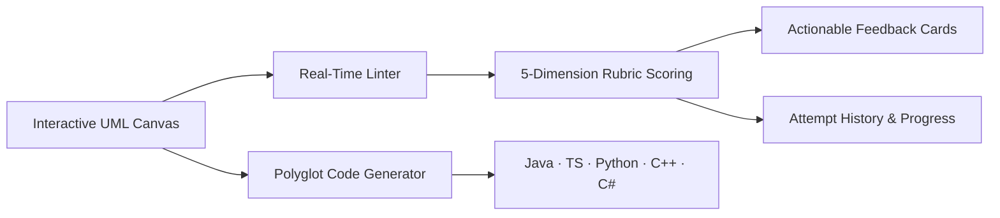

# LLDSIM — Interactive Low-Level Design (LLD) Studio

<div align="center">

[](LICENSE)
[](https://react.dev/)
[](https://www.typescriptlang.org/)
[](https://vitejs.dev/)
[](https://tailwindcss.com/)
[](https://reactflow.dev/)
[](https://www.w3.org/WAI/standards-guidelines/wcag/)

**The "LeetCode for Object-Oriented & Low-Level Design Interviews".**  
*A browser-native, zero-latency computer-aided design studio for modeling, validating, scoring, and synthesizing class architectures.*

[Live Demo](https://lld-ease.vercel.app/) • [Overview](#-overview) • [Core Features](#-core-features) • [Problem Catalog](#-curated-problem-catalog) • [Architecture](#-architecture--clean-domain-isolation) • [Keyboard Shortcuts](#-keyboard-shortcuts) • [Quick Start](#-quick-start) • [License](#-license)

</div>

---

## 📖 Overview

In modern software engineering interviews, **Low-Level Design (LLD)** and **Object-Oriented Design (OOD)** evaluate an engineer's ability to translate complex, ambiguous business requirements into clean, extensible, decoupled, and maintainable software architectures.

Generic whiteboarding tools (*Excalidraw*, *Miro*) lack semantic UML understanding and cannot grade architecture. Algorithmic judges (*LeetCode*, *HackerRank*) only test $O(N)$ runtime of isolated functions. Passive video tutorials foster an illusion of competence without active recall.

**LLDSIM bridges this divide.** It provides an interactive modeling studio powered by an intelligent evaluation engine:
1. **Semantic UML Class Modeling:** Draw formal class diagrams with strict stereotypes, typed compartments, and UML 2.5 relationship semantics.
2. **Automated Rubric Scoring:** A 5-dimension deterministic evaluation engine scores candidate designs (0–100) against industry benchmark reference solutions.
3. **Actionable Mentorship Feedback:** Categorized guidance cards (*Concerns*, *Suggestions*, *Affirmations*) identify missing abstractions, wrong multiplicity, and design pattern anti-patterns.
4. **Polyglot Real-Time Codegen:** Instant transpilation to **Java, TypeScript, Python, JavaScript, C++, and C#** with customizable getters/setters and docstrings.
5. **Interactive Reference Solutions:** Benchmark solutions open in side-by-side tabs with movable nodes and a lock/unlock toggle.
6. **Zero-Backend Client-Side Engine:** 100% browser-native execution with local persistence — sub-millisecond evaluation, zero latency, complete candidate privacy, and zero server hosting fees.

---

## ⚡ Core Features



### 1. Intelligent UML Canvas Studio
- **5 UML Classifier Kinds:** `Class`, `Abstract Class`, `Interface`, `Enum`, `Record`.
- **Compartmentalized Class Headers:** Stereotype indicators (`«interface»`, `«enumeration»`), typed attribute rows with visibility sigils (`+`, `-`, `#`, `~`), and typed method rows with parameters and return types.
- **6 Formal UML Connector Typologies:**
  - **Inheritance** (Solid line + closed hollow triangle)
  - **Realization** (Dashed line + closed hollow triangle)
  - **Composition** (Solid line + filled diamond at container)
  - **Aggregation** (Solid line + hollow diamond at container)
  - **Association** (Solid line + open arrow + role label + multiplicity)
  - **Dependency** (Dashed line + open arrow)
- **Whiteboard Affordances:** Freehand vector ink drawing with Catmull-Rom spline smoothing and resizable colored sticky notes for brainstorming.

### 2. Automated 5-Dimension Evaluation Engine
- **Abstractions (35%):** Normalized Levenshtein string distance ($\ge 0.6$ threshold) and greedy bipartite matching to pair candidate classes with reference classes, scoring kind alignment and member coverage.
- **Relationships (30%):** Validates structural connectivity, edge directionality, and correct coupling classifications (e.g. Composition vs Aggregation).
- **Design Patterns (20%):** Detects signature architectural topologies (Strategy, Factory, State, Observer, Singleton, Template Method).
- **Code Quality / SOLID Heuristics (10%):** Identifies god-classes ($>7$ methods), empty models, and excessive inheritance depth.
- **Rubric Guidance (5%):** Penalizes anti-patterns and produces ranked, node-anchored action items.

### 3. Real-Time Multi-Language Code Synthesis
Diagram changes continuously recompile into idiomatic source code across 6 languages:
- **Java** (interfaces, abstract classes, access modifiers, `@Override`)
- **TypeScript** (type annotations, export declarations, interface contracts)
- **Python** (`abc.ABC`, `@abstractmethod`, `__init__` constructor, dataclasses)
- **JavaScript** (ES6 classes, constructor assignments)
- **C++** (header/class definitions, virtual destructors, pure virtual methods)
- **C#** (PascalCase naming, namespace grouping, property getters/setters)
- Configurable generation toggles: Constructors, Getters/Setters, `toString()`, `equals()`/`hashCode()`, and Doc Comments.

### 4. Interactive Benchmark Solutions
- Click **"View solution"** to inspect verified benchmark reference diagrams in a dedicated **REF** tab.
- **Movable & Reorganizable:** Nodes are draggable on the canvas, allowing users to rearrange layouts and trace complex relationships.
- **Lock / Unlock Toggle:** Easily toggle between locked (read-only) and unlocked (editable) modes.

---

## 📚 Curated Problem Catalog

LLDSIM includes 10 canonical machine-coding interview problems authored with verified benchmark reference architectures:

| Problem | Difficulty | Key Design Patterns Exercised | Benchmark Complexity |
| :--- | :---: | :--- | :---: |
| **Parking Lot** | Medium | Strategy, Factory, Singleton | 15 classes · 15 relationships |
| **Splitwise (Expense Sharing)** | Medium | Strategy, Factory | 10 classes · 10 relationships |
| **Elevator System** | Hard | Strategy, State | 7 classes · 7 relationships |
| **Vending Machine** | Medium | State Pattern | 8 classes · 8 relationships |
| **Library Management** | Medium | Aggregate Root | 8 classes · 8 relationships |
| **Chess Game Rules Engine** | Hard | Factory, Strategy, Template Method | 12 classes · 13 relationships |
| **LRU Cache** | Easy | Strategy, HashMap + Doubly Linked List | 5 classes · 5 relationships |
| **Movie Ticket Booking** | Medium | Singleton, Observer, Strategy | 10 classes · 10 relationships |
| **Restaurant Table Reservation** | Medium | Aggregate Root, State | 6 classes · 6 relationships |
| **Tic-Tac-Toe** | Easy | OOP Fundamentals, Board State | 6 classes · 5 relationships |

---

## 🏗️ Architecture & Clean Domain Isolation

The project strictly isolates pure domain logic from UI presentation:

```
src/
├── domain/                  # PURE TypeScript (0 dependencies on React, DOM, or Zustand)
│   ├── codegen/             # AST code generators (Java, TS, Python, JS, C++, C#)
│   ├── feedback/            # 4-lens explainable qualitative feedback engine
│   ├── lint/                # 14 architectural lint rules (cycles, multiple inheritance, etc.)
│   ├── practice/            # Practice sessions & attempt snapshot models
│   ├── problems/            # 10 canonical LLD problems & reference diagrams
│   ├── scoring/             # 5-dimension quantitative evaluation engine
│   ├── serialization/       # JSON schema validators & migration engine
│   └── types.ts             # Core domain interfaces (ClassNode, Relationship, Diagram)
├── store/                   # Centralized State Management (Zustand + Zundo temporal undo/redo)
│   ├── workspaceSlice.ts    # Multi-tab management, active document, reference diagram loader
│   ├── documentSlice.ts     # Immutable diagram mutations, node/edge CRUD, position tracking
│   ├── practiceSlice.ts     # Practice session lifecycle, prompt state, attempt history
│   ├── uiSlice.ts           # Armed tools, modal dialogs, inspector tab state, selection
│   └── toastSlice.ts        # Lightweight notifications
├── components/              # Modular UI Component Tree
│   ├── canvas/              # React Flow stage, custom ClassNode, RelationshipEdge, Ink, Stickies
│   ├── home/                # Landing page hero, problem grid showcase, footer (GSAP + Lenis)
│   ├── layout/              # AppHeader, DocumentTabBar, PaletteSidebar, ProblemContextPanel
│   ├── library/             # ProblemLibraryModal, ProblemCard, AttemptHistoryModal
│   ├── panel/               # Right sidebar: Inspector, Issues, Code Generator, Notes
│   └── ui/                  # Reusable atomic design components (Button, Modal, Tabs, Logo)
├── hooks/                   # Custom Hooks (useDocumentSync, useMediaQuery, useDragToCanvas)
└── styles/                  # CSS Design Tokens (tokens.css) & Tailwind Configuration
```

### Key Architectural Decisions
- **Zero Framework Leakage:** The entire `domain/` layer (linting, scoring, codegen) consists of pure functions runnable in Node.js, Web Workers, or headless CI without DOM mocks.
- **Deterministic Pure Functions:** Given identical diagram snapshots, `scoreAgainstReference()` and `generateCode()` produce byte-exact, deterministic outputs.
- **Temporal History (Zundo):** Undo/redo (`⌘Z`, `⌘⇧Z`) selectively tracks canvas models while ignoring transient UI states (zoom, armed tools, selection).
- **LocalStorage Auto-Persistence:** Workspaces auto-save with debouncing to prevent data loss across refreshes and browser crashes.

---

## ⌨️ Keyboard Shortcuts

| Shortcut | Action | Scope |
| :--- | :--- | :---: |
| `⌘Z` / `Ctrl+Z` | **Undo** canvas mutation | Canvas |
| `⌘⇧Z` / `Ctrl+Y` | **Redo** mutation | Canvas |
| `Delete` / `Backspace` | **Delete** selected node or relationship | Canvas |
| `Escape` | **Deselect** element, cancel tool, or close modal | Global |
| `⌘S` / `Ctrl+S` | **Export** diagram JSON | Global |
| `⌘0` / `Ctrl+0` | **Fit View** to canvas content | Canvas |
| `1` | Arm **Class** tool | Canvas |
| `2` | Arm **Abstract Class** tool | Canvas |
| `3` | Arm **Interface** tool | Canvas |
| `4` | Arm **Enum** tool | Canvas |
| `5` | Arm **Record** tool | Canvas |
| `⌘B` / `Ctrl+B` | Toggle **Bold** text | Sticky Note |
| `⌘I` / `Ctrl+I` | Toggle **Italic** text | Sticky Note |

*Note: Single-key shortcuts (`1`–`5`, `Delete`, `Backspace`) are automatically suppressed while editing inputs, textareas, or sticky notes.*

---

## 🚀 Quick Start

### Prerequisites
- **Node.js**: `>= 18.0.0`
- **npm**: `>= 9.0.0`

### Installation
```bash
# Clone the repository
git clone https://github.com/anand-242003/LLD_Ease.git
cd LLD_Ease

# Install dependencies
npm install

# Start the Vite development server
npm run dev
```
Open [http://localhost:5173](http://localhost:5173) in your browser.

### Scripts
```bash
npm run dev      # Start development server with HMR
npm run build    # Run TypeScript compilation & production Vite build
npm run preview  # Preview the production build locally
```

---

## 📂 Project Documentation

- [`MVP_DOCUMENTATION.md`](./MVP_DOCUMENTATION.md) — Product & Technical Specification (MVP Architecture & Trade-Offs)
- [`AI_USAGE.md`](./AI_USAGE.md) — AI-assisted development decisions and architectural rationale
- [`PRD.md`](./PRD.md) — Product Requirements Document (Business rules, data contracts, UX specifications)
- [`DESIGN.md`](./DESIGN.md) — Visual Design System, color tokens, and accessibility standards
- [`PHASES.md`](./PHASES.md) — Phased engineering build history and release gates

---

## 📄 License

This project is open-source software licensed under the [MIT License](LICENSE).  
Copyright © 2026 LLDSIM Contributors.
